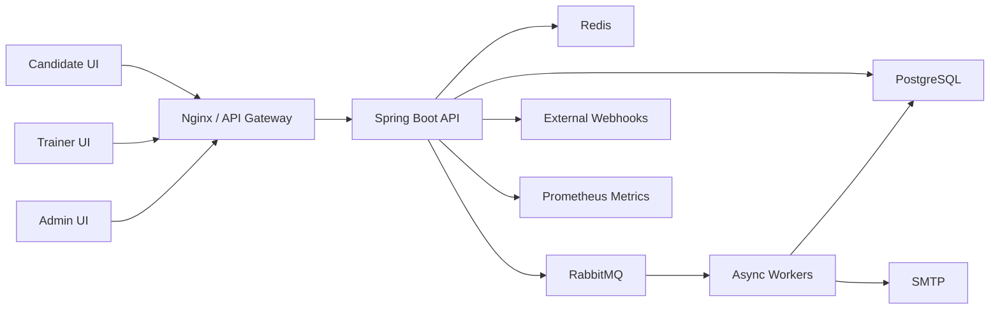
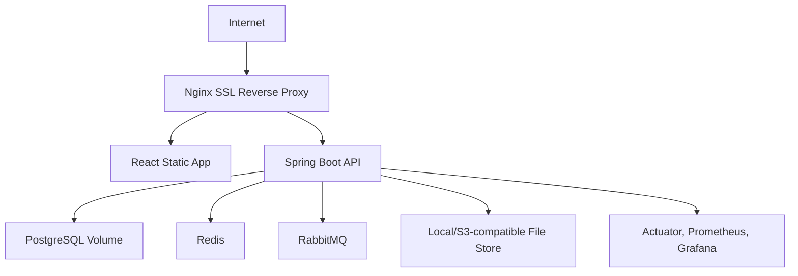

# Architecture Document

## Logical Architecture

## Bounded Contexts

- Identity and access.
- Organization management.
- Question bank governance.
- Assessment authoring.
- Candidate delivery.
- Scoring and evaluation.
- Reporting and analytics.
- Notification and communication.
- Audit and security.
- Integrations and operations.

## Deployment Architecture

## Data Flow: Candidate Attempt

1. Candidate opens secure magic link.
2. Backend validates token, expiry, assessment window, device policy, and attempt eligibility.
3. Candidate completes OTP verification when enabled.
4. Candidate answers are autosaved.
5. Anti-cheating events are recorded as attempt events.
6. Timeout or manual submit finalizes the attempt.
7. Scoring jobs run.
8. Reports, notifications, certificates, and webhooks are generated.

