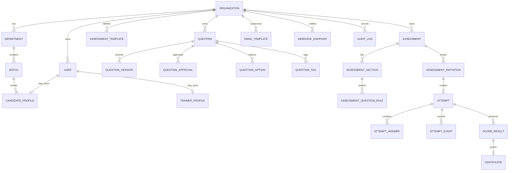

# ER Diagram

## Notes

- `organization_id` is mandatory for tenant-scoped tables.
- Audit logs are append-only.
- Question versions preserve historical assessment integrity.
- Attempt answers must reference the exact question version presented to the candidate.

